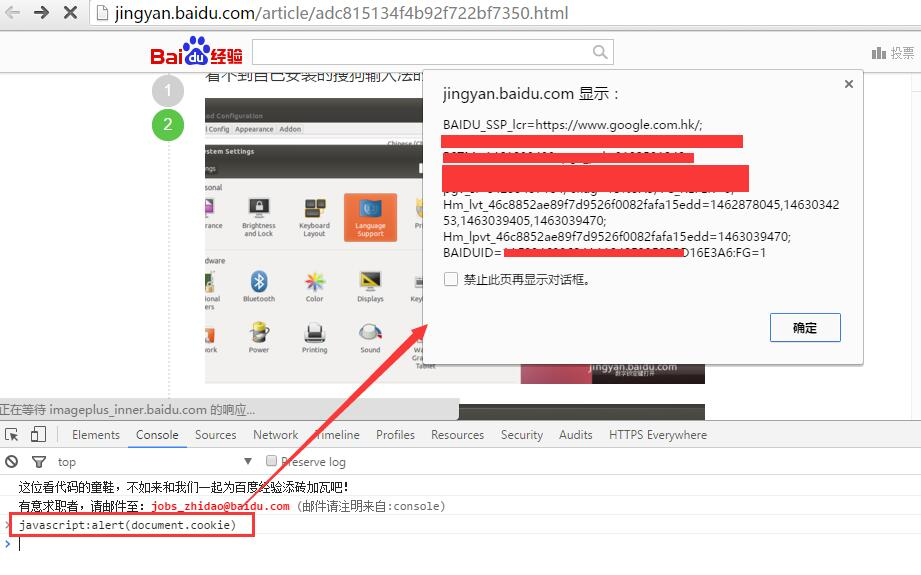

HTTP是一个无状态协议，如果想持续为用户服务（知道是那个用户在访问）就需要会话跟踪。会话（Session）跟踪是Web程序中常用的技术，用来跟踪用户的整个会话。常用的会话跟踪技术是`Cookie`与`Session`。

- Cookie通过在客户端记录信息确定用户身份，
- Session通过在服务器端记录信息确定用户身份。

##什么是Cookie

Cookie意为“甜饼”，是由W3C组织提出，最早由Netscape社区发展的一种机制。目前Cookie已经成为标准，所有的主流浏览器如IE、Netscape、Firefox、Opera等都支持Cookie。

由于**HTTP是一种无状态的协议**，服务器单从网络连接上无从知道客户身份。怎么办呢？就给客户端们颁发一个通行证吧，每人一个，无论谁访问都必须携带自己通行证。这样服务器就能从通行证上确认客户身份了。这就是Cookie的工作原理。

Cookie实际上是一小段的文本信息。客户端请求服务器，如果服务器需要记录该用户状态，就使用response向客户端浏览器颁发一个Cookie。客户端浏览器会把Cookie保存起来。当浏览器再请求该网站时，浏览器把请求的网址连同该Cookie一同提交给服务器。服务器检查该Cookie，以此来辨认用户状态。服务器还可以根据需要修改Cookie的内容。


###会话跟踪
在程序中，**会话跟踪是很重要的事情**。

>理论上，一个用户的所有请求操作都应该属于同一个会话，而另一个用户的所有请求操作则应该属于另一个会话，二者不能混淆。例如，用户A在超市购买的任何商品都应该放在A的购物车内，不论是用户A什么时间购买的，这都是属于同一个会话的，不能放入用户B或用户C的购物车内，这不属于同一个会话。

>而Web应用程序是使用HTTP协议传输数据的。**HTTP协议是无状态的协议**。_一旦数据交换完毕，客户端与服务器端的连接就会关闭，再次交换数据需要建立新的连接_。这就意味着服务器无法从连接上跟踪会话。即用户A购买了一件商品放入购物车内，当再次购买商品时服务器已经无法判断该购买行为是属于用户A的会话还是用户B的会话了。要跟踪该会话，必须引入一种机制。

Cookie就是这样的一种机制。它可以弥补HTTP协议无状态的不足。在Session出现之前，基本上所有的网站都采用Cookie来跟踪会话。

##Cookie机制

**Cookie技术是客户端的解决方案**。

>通常，我们可以从很多网站的登录界面中看到“**请记住我**”这样的选项，如果你勾选了它之后再登录，那么在下一次访问该网站的时候就不需要进行重复而繁琐的登录动作了，而这个功能就是通过Cookie实现的。

###Cookie 工作机制
Cookie就是由服务器发给客户端的特殊信息，而这些信息以文本文件的方式存放在客户端，然后客户端每次向服务器发送请求的时候都会带上这些特殊的信息。

- 当用户使用浏览器访问一个支持Cookie的网站的时候，用户会提供包括用户名在内的个人信息并且提交至服务器；
- 接着，服务器在向客户端回传相应的超文本的同时也会发回这些个人信息，当然这些信息并不是存放在HTTP响应体（Response Body）中的，而是存放于HTTP响应头（Response Header）；
- 当客户端浏览器接收到来自服务器的响应之后，浏览器会将这些信息存放在一个统一的位置，对于`Windows`操作系统而言，我们可以从：`[系统盘]:\Documents and Settings\[用户名]\Cookies目录中找到存储的Cookie`；
- 自此，客户端再向服务器发送请求的时候，都会把相应的Cookie再次发回至服务器。而这次，Cookie信息则存放在HTTP请求头（Request Header）了。

有了Cookie这样的技术实现，服务器在接收到来自客户端浏览器的请求之后，就能够通过分析存放于请求头的Cookie得到客户端特有的信息，从而动态生成与该客户端相对应的内容。

###Cookie 生命周期和工作流程
如果你把`Cookies`看成为HTTP协议的一个扩展的话，理解起来就容易的多了，其实本质上`cookies`就是HTTP协议的一个扩展。有两个HTTP头部是专门负责设置以及发送`cookie`的,它们分别是:`Set-Cookie`以及`Cookie`。

当服务器返回给客户端一个HTTP响应信息时，其中如果包含`Set-Cookie`这个头部时，意思就是指示客户端建立一个cookie，并且在后续的HTTP请求中自动发送这个cookie到服务器端，直到这个cookie过期。

如果**cookie的生存时间是整个会话期间的话，那么浏览器会将cookie保存在内存中，浏览器关闭时就会自动清除这个cookie**。另外一种情况就是**保存在客户端的硬盘中，浏览器关闭的话，该cookie也不会被清除**，下次打开浏览器访问对应网站时，这个cookie就会自动再次发送到服务器端。一个cookie的设置以及发送过程分为以下四步：

1. 客户端发送一个HTTP请求到服务器端 
2. 服务器端发送一个HTTP响应到客户端，其中包含Set-Cookie头部
3. 客户端发送一个HTTP请求到服务器端，其中包含Cookie头部 
4. 服务器端发送一个HTTP响应到客户端

这个通讯过程也可以用以下下示意图来描述：


在客户端的第二次请求中包含的Cookie头部中，提供给了服务器端可以用来唯一标识客户端身份的信息。这时，服务器端也就可以判断客户端是否启用了cookies。尽管，用户可能在和应用程序交互的过程中突然禁用cookies的使用，但是，这个情况基本是不太可能发生的，所以可以不考虑，这在实践中也被证明是对的。

除了cookies,客户端还可以将发送给服务器的数据包含在请求的url中，比如请求的参数或者请求的路径中。 我们来看一个常规的http get 请求例子：
```
GET /index.php?foo=bar HTTP/1.1 host: example.org
```
另外一种客户端传递数据到服务器端的方式是将数据包含在http请求的内容区域内。 这种方式需要请求的类型是POST的，看下面一个例子：
```
POST /index.php HTTP/1.1 Host: example.org Content-Type: application/x-www-form-urlencoded Content-Length: 7

foo=bar
```
在一个请求中，可以同时包含这两种形式的数据：
```
POST /index.php?myget=foo HTTP/1.1 Host: example.orgContent-Type: application/x-www-form-urlencoded Content-Length: 11

mypost=bar
```
这两种传递数据的方式，比起用cookies来传递数据更稳定，因为cookie可能被禁用，但是以GET以及POST方式传递数据时，不存在这种情况。我们可以将PHPSESSID包含在http请求的url中，就像下面的例子一样：
```
GET /index.php?PHPSESSID=12345 HTTP/1.1 Host: example.org
```

##如何查看Cookie

查看某个网站颁发的Cookie很简单。在Chrome浏览器 Console 栏输入`javascript:alert(document.cookie)`就可以了（需要有网才能查看）。JavaScript脚本会弹出一个对话框显示本网站颁发的所有Cookie的内容，如图所示。


上图中弹出的对话框中显示的为Baidu网站的Cookie。其中BAIDUID记录的就是笔者的身份，只是Baidu使用特殊的方法将Cookie信息加密了。

>注意：**Cookie功能需要浏览器的支持。如果浏览器不支持Cookie（如大部分手机中的浏览器）或者把Cookie禁用了，Cookie功能就会失效**。不同的浏览器采用不同的方式保存Cookie。IE浏览器会在“C:\Documents and Settings\你的用户名\Cookies”文件夹下以文本文件形式保存，一个文本文件保存一个Cookie。

##Cookie 存储结构

Java中把Cookie封装成了javax.servlet.http.Cookie类。每个Cookie都是该Cookie类的对象。服务器通过操作Cookie类对象对客户端Cookie进行操作。通过request.getCookie获取客户端提交的所有Cookie（以Cookie数组形式返回），通过response.addCookie(Cookiecookie)向客户端设置Cookie。

Cookie对象使用key-value属性对的形式保存用户状态，一个Cookie对象保存一个属性对，一个request或者response同时使用多个Cookie。因为Cookie类位于包javax.servlet.http.*下面，所以JSP中不需要import该类。


###设置Cookie的所有属性

除了name与value之外，Cookie还具有其他几个常用的属性。每个属性对应一个getter方法与一个setter方法。Cookie类的所有属性如下所示：

| 类型 | 属性名| 解释|
|---|---|---|
|String| name：该Cookie的名称。|**Cookie一旦创建，名称便不可更改**。|
|Object| value：该Cookie的值。|如果值为Unicode字符，需要为字符编码。如果值为二进制数据，则需要使用BASE64编码。|
|int| maxAge：该Cookie失效的时间，单位秒。|如果为正数，则该Cookie在maxAge秒之后失效。如果为负数，该Cookie为临时Cookie，关闭浏览器即失效，浏览器也不会以任何形式保存该Cookie。如果为0，表示删除该Cookie。默认为–1。|
|boolean| secure：该Cookie是否仅被使用安全协议传输。|安全协议。安全协议有HTTPS，SSL等，在网络上传输数据之前先将数据加密。默认为false。|
|String| path：该Cookie的使用路径。|如果设置为“/sessionWeb/”，则只有contextPath为“/sessionWeb”的程序可以访问该Cookie。如果设置为“/”，则本域名下contextPath都可以访问该Cookie。注意最后一个字符必须为“/”。|
|String| domain：可以访问该Cookie的域名。|如果设置为“.google.com”，则所有以“google.com”结尾的域名都可以访问该Cookie。注意第一个字符必须为“.”。|
|String| comment：该Cookie的用处说明。|浏览器显示Cookie信息的时候显示该说明。|
|int| version：该Cookie使用的版本号。|0表示遵循Netscape的Cookie规范，1表示遵循W3C的RFC 2109规范。|

###Unicode编码：保存中文

中文与英文字符不同，中文属于Unicode字符，在内存中占4个字符，而英文属于ASCII字符，内存中只占2个字节。Cookie中使用Unicode字符时需要对Unicode字符进行编码，否则会乱码。

>提示：Cookie中保存中文只能编码。一般使用UTF-8编码即可。**不推荐使用GBK等中文编码，因为浏览器不一定支持，而且JavaScript也不支持GBK编码**。

###BASE64编码：保存二进制图片

Cookie不仅可以使用ASCII字符与Unicode字符，还可以使用二进制数据。例如在Cookie中使用数字证书，提供安全度。使用二进制数据时也需要进行编码。

>注意：本程序仅用于展示Cookie中可以存储二进制内容，并不实用。由于浏览器每次请求服务器都会携带Cookie，因此**Cookie内容不宜过多，否则影响速度**。Cookie的内容应该少而精。

###Cookie的域名

Cookie是不可跨域名的。域名颁发的Cookie不会被提交到域名www.baidu.com去。这是由Cookie的隐私安全机制决定的。隐私安全机制能够禁止网站非法获取其他网站的Cookie。

####Cookie的不可跨域名性

很多网站都会使用Cookie。例如，google会向客户端颁发Cookie，Baidu也会向客户端颁发Cookie。那浏览器访问Google会不会也携带上Baidu颁发的Cookie呢？或者Google能不能修改Baidu颁发的Cookie呢？

答案是否定的。Cookie具有不可跨域名性。根据Cookie规范，浏览器访问Google只会携带Google的Cookie，而不会携带Baidu的Cookie。Google也只能操作Google的Cookie，而不能操作Baidu的Cookie。

Cookie在客户端是由浏览器来管理的。浏览器能够保证Google只会操作Google的Cookie而不会操作Baidu的Cookie，从而保证用户的隐私安全。浏览器判断一个网站是否能操作另一个网站Cookie的依据是域名。Google与Baidu的域名不一样，因此Google不能操作Baidu的Cookie。

**需要注意的是，虽然网站images.google.com与网站同属于Google，但是域名不一样，二者同样不能互相操作彼此的Cookie。**

>注意：用户登录网站之后会发现访问images.google.com时登录信息仍然有效，而普通的Cookie是做不到的。这是因为Google做了特殊处理。本章后面也会对Cookie做类似的处理。

#### 域名的设置

正常情况下，同一个一级域名下的两个二级域名如和images.helloweenvsfei.com也不能交互使用Cookie，因为二者的域名并不严格相同。如果想所有helloweenvsfei.com名下的二级域名都可以使用该Cookie，需要设置Cookie的domain参数，例如：

```
 Cookie cookie = new Cookie("time","20080808"); // 新建Cookie
 cookie.setDomain(".helloweenvsfei.com"); // 设置域名 
 cookie.setPath("/"); // 设置路径 
 cookie.setMaxAge(Integer.MAX_VALUE); // 设置有效期 
 response.addCookie(cookie); // 输出到客户端
```
 读者可以修改本机下的hosts文件来配置多个临时域名，然后使用setCookie.jsp程序来设置跨域名Cookie验证domain属性。
 
>注意：domain参数必须以点(".")开始。另外，name相同但domain不同的两个Cookie是两个不同的Cookie。如果想要两个域名完全不同的网站共有Cookie，可以生成两个Cookie，domain属性分别为两个域名，输出到客户端。


###Cookie的路径

domain属性决定运行访问Cookie的域名，而path属性决定允许访问Cookie的路径（ContextPath）。例如，如果只允许/sessionWeb/下的程序使用Cookie，可以这么写：

```
Cookie cookie = new Cookie("time","20080808"); // 新建Cookie 
cookie.setPath("/sessionWeb/"); // 设置路径 
response.addCookie(cookie); // 输出到客户端

```

设置为“/”时允许所有路径使用Cookie。**path属性需要使用符号“/”结尾**。name相同但domain不同的两个Cookie也是两个不同的Cookie。


>注意：页面只能获取它属于的Path的Cookie。例如/session/test/a.jsp不能获取到路径为`/session/abc/`的Cookie。使用时一定要注意。

domain表示的是cookie所在的域，默认为请求的地址，如网址为`www.test.com/test/test.aspx`，那么domain默认为`www.test.com`。而跨域访问，如域A为`t1.test.com`，域B为`t2.test.com`，那么在域A生产一个令域A和域B都能访问的cookie就要将该cookie的domain设置为`.test.com`；如果要在域A生产一个令域A不能访问而域B能访问的cookie就要将该cookie的domain设置为`t2.test.com`。

path表示cookie所在的目录，默认为/，就是根目录。在同一个服务器上有目录如下：`/test/`,`/test/cd/`,`/test/dd/`，现设一个cookie1的path为`/test/`，cookie2的path为`/test/cd/`，那么test下的所有页面都可以访问到cookie1，而`/test/`和`/test/dd/`的子页面不能访问cookie2。这是因为cookie能让其path路径下的页面访问。

浏览器会将domain和path都相同的cookie保存在一个文件里，cookie间用*隔开。

###Cookie的安全属性

HTTP协议不仅是**无状态**的，而且是**不安全**的。使用HTTP协议的数据不经过任何加密就直接在网络上传播，有被截获的可能。使用HTTP协议传输很机密的内容是一种隐患。如果不希望Cookie在HTTP等非安全协议中传输，可以设置Cookie的secure属性为true。浏览器只会在HTTPS和SSL等安全协议中传输此类Cookie。下面的代码设置secure属性为true：

```
Cookie cookie = new Cookie("time", "20080808"); // 新建Cookie 
cookie.setSecure(true); // 设置安全属性 
response.addCookie(cookie); // 输出到客户端
```

提示：secure属性并不能对Cookie内容加密，因而不能保证绝对的安全性。如果需要高安全性，需要在程序中对Cookie内容加密、解密，以防泄密。

###Cookie的有效期

Cookie的maxAge决定着Cookie的有效期，单位为秒（Second）。Cookie中通过getMaxAge方法与setMaxAge(int maxAge)方法来读写maxAge属性。如果maxAge属性为正数，则表示该Cookie会在maxAge秒之后自动失效。浏览器会将maxAge为正数的Cookie持久化，即写到对应的Cookie文件中。无论客户关闭了浏览器还是电脑，只要还在maxAge秒之前，登录网站时该Cookie仍然有效。下面代码中的Cookie信息将永远有效。

```
Cookie cookie = new Cookie("username","helloweenvsfei"); // 新建Cookie 
cookie.setMaxAge(Integer.MAX_VALUE); // 设置生命周期为MAX_VALUE 
response.addCookie(cookie); // 输出到客户端

```

- 如果maxAge为负数，则表示该Cookie仅在本浏览器窗口以及本窗口打开的子窗口内有效，关闭窗口后该Cookie即失效。maxAge为负数的Cookie，为临时性Cookie，不会被持久化，不会被写到Cookie文件中。Cookie信息保存在浏览器内存中，因此关闭浏览器该Cookie就消失了。Cookie默认的maxAge值为–1。

- 如果maxAge为0，则表示删除该Cookie。Cookie机制没有提供删除Cookie的方法，因此通过设置该Cookie即时失效实现删除Cookie的效果。失效的Cookie会被浏览器从Cookie文件或者内存中删除：

```
Cookie cookie = new Cookie("username","helloweenvsfei"); // 新建Cookie 
cookie.setMaxAge(0); // 设置生命周期为0，不能为负数 
response.addCookie(cookie); // 必须执行这一句
```

response对象提供的Cookie操作方法只有一个添加操作add(Cookie cookie)。要想修改Cookie只能使用一个同名的Cookie来覆盖原来的Cookie，达到修改的目的。删除时只需要把maxAge修改为0即可。

>注意：从客户端读取Cookie时，包括maxAge在内的其他属性都是不可读的，也不会被提交。浏览器提交Cookie时只会提交name与value属性。maxAge属性只被浏览器用来判断Cookie是否过期。

***

##Cookie 操作

###Cookie的修改、删除

Cookie并**不提供修改、删除操作**。如果要修改某个Cookie，只需要新建一个同名的Cookie，添加到response中**覆盖**原来的Cookie。如果要删除某个Cookie，只需要新建一个同名的Cookie，并将maxAge设置为0，并添加到response中覆盖原来的Cookie。注意是0而不是负数。负数代表其他的意义。读者可以通过上例的程序进行验证，设置不同的属性。

>注意：修改、删除Cookie时，新建的Cookie除value、maxAge之外的所有属性，例如name、path、domain等，都要与原Cookie完全一样。否则，浏览器将视为两个不同的Cookie不予覆盖，导致修改、删除失败。

###JavaScript操作Cookie

Cookie是保存在浏览器端的，因此**浏览器具有操作Cookie的先决条件**。浏览器可以使用脚本程序如JavaScript或者VBScript等操作Cookie。这里以JavaScript为例介绍常用的Cookie操作。例如下面的代码会输出本页面所有的Cookie。

```
<script>document.write(document.cookie);</script> 
```

由于JavaScript能够任意地读写Cookie，有些好事者便想使用JavaScript程序去窥探用户在其他网站的Cookie。不过这是徒劳的，W3C组织早就意识到JavaScript对Cookie的读写所带来的安全隐患并加以防备了，**W3C标准的浏览器会阻止JavaScript读写任何不属于自己网站的Cookie**。换句话说，A网站的JavaScript程序读写B网站的Cookie不会有任何结果。

***

##Session机制

###什么是Session
　Session是另一种记录客户状态的机制，不同的是Cookie保存在客户端浏览器中，而Session保存在服务器上。客户端浏览器访问服务器的时候，服务器把客户端信息以某种形式记录在服务器上。这就是Session。客户端浏览器再次访问时只需要从该Session中查找该客户的状态就可以了。

>如果说Cookie机制是通过检查客户身上的“通行证”来确定客户身份的话，那么Session机制就是通过检查服务器上的“客户明细表”来确认客户身份（客服端只存了一个Session Id）。Session相当于程序在服务器上建立的一份客户档案，客户来访的时候只需要查询客户档案表就可以了。
　
##Session 工作机制

Session技术则是**服务端的解决方案**，它是通过服务器来保持状态的。由于Session这个词汇包含的语义很多，因此需要在这里明确一下Session的含义。

- 首先，我们通常都会把Session翻译成会话，因此我们可以把客户端浏览器与服务器之间一系列交互的动作称为一个Session。从这个语义出发，我们会提到Session持续的时间，会提到在Session过程中进行了什么操作等等；

- 其次，Session指的是服务器端为客户端所开辟的存储空间，在其中保存的信息就是用于保持状态。从这个语义出发，我们则会提到往Session中存放什么内容，如何根据键值从Session中获取匹配的内容等。

要使用Session，第一步当然是创建Session了。

**那么Session在何时创建呢？**

当然还是在服务器端程序运行的过程中创建的，不同语言实现的应用程序有不同创建Session的方法，而在Java中是通过调用`HttpServletRequest`的`getSession`方法（使用`true`作为参数）创建的。

在创建了Session的同时，服务器会为该Session生成唯一的Session  ID，而这个Session  ID在随后的请求中会被用来重新获得已经创建的Session；在Session被创建之后，就可以调用Session相关的方法往Session中增加内容了，而这些内容只会保存在服务器中，发到客户端的只有Session ID；当客户端再次发送请求的时候，会将这个Session ID带上，服务器接受到请求之后就会依据Session ID找到相应的Session，从而再次使用之。正是这样一个过程，用户的状态也就得以保持了。

>提示：Session是服务器端使用的一种记录客户端状态的机制，使用上比Cookie简单一些，相应的也增加了服务器的存储压力。　　


###Session 客服端存储位置
　
####使用Cookie存储

**Session机制是一种服务器端的机制**，服务器使用一种类似于散列表的结构（也可能就是使用散列表）来保存信息。由于采用服务器端保持状态的方案在客户端也需要保存一个标识，所以session机制**可能**需要借助于cookie机制来达到保存标识的目的（注意用cookie存储是一种简单常见的方式，但不是必须存在于cookie中）。而session提供了方便管理全局变量的方式 。

session是针对每一个用户的，变量的值保存在服务器上，用一个sessionID来区分是哪个用户session变量,这个值是通过用户的浏览器在访问的时候返回给服务器，当客户禁用cookie时，这个值也可能设置为由get来返回给服务器。

>就安全性来说：当你访问一个使用session 的站点，同时在自己机子上建立一个cookie，建议在服务器端的session机制更安全些，因为它不会任意读取客户存储的信息。


当程序需要为某个客户端的请求创建一个session时，服务器首先检查这个客户端的请求里是否已包含了一个session标识（称为session id），如果已包含则说明以前已经为此客户端创建过session，服务器就按照session id把这个session检索出来使用（检索不到，会新建一个），如果客户端请求不包含session id，则为此客户端创建一个session并且生成一个与此session相关联的session id，session id的值应该是一个既不会重复，又不容易被找到规律以仿造的字符串，这个session id将被在本次响应中返回给客户端保存。

保存这个session id的方式可以采用cookie，这样在交互过程中浏览器可以自动的按照规则把这个标识发挥给服务器。一般这个cookie的名字都是类似于SEEESIONID。但cookie可以被人为的禁止，则必须有其他机制以便在cookie被禁止时仍然能够把session id传递回服务器。

####附加到URL路径

经常被使用的一种技术叫做URL重写，就是把session id直接附加在URL路径的后面。还有一种技术叫做表单隐藏字段。就是服务器会自动修改表单，添加一个隐藏字段，以便在表单提交时能够把session id传递回服务器。


###Session的生命周期
　　Session保存在服务器端。为了获得更高的存取速度，服务器**一般**把Session放在内存里。每个用户都会有一个独立的Session。如果Session内容过于复杂，当大量客户访问服务器时可能会导致内存溢出。因此，Session里的信息应该尽量精简。

　　Session在用户第一次访问服务器的时候自动创建。需要注意只有访问JSP、Servlet等程序时才会创建Session，只访问HTML、IMAGE等静态资源并不会创建Session。如果尚未生成Session，也可以使用request.getSession(true)强制生成Session。

　　Session生成后，只要用户继续访问，服务器就会更新Session的最后访问时间，并维护该Session。用户每访问服务器一次，无论是否读写Session，服务器都认为该用户的Session“活跃（active）”了一次。
　
###Session的有效期
　　由于会有越来越多的用户访问服务器，因此Session也会越来越多。为防止内存溢出，服务器会把长时间内没有活跃的Session从内存删除。这个时间就是Session的超时时间。如果超过了超时时间没访问过服务器，Session就自动失效了。
　　
Session的超时时间为maxInactiveInterval属性，可以通过对应的getMaxInactiveInterval()获取，通过setMaxInactiveInterval(longinterval)修改。

　　Session的超时时间也可以在web.xml中修改。另外，通过调用Session的invalidate()方法可以使Session失效。

####Session 何时关闭？
　
在谈论session机制的时候，常常听到这样一种误解“**只要关闭浏览器，session就消失了**”。其实可以想象一下会员卡的例子，除非顾客主动对店家提出销卡，否则店家绝对不会轻易删除顾客的资料。对session来说也是一样的，除非程序通知服务器删除一个session，否则服务器会一直保留，程序一般都是在用户做log  off的时候发个指令去删除session。然而浏览器从来不会主动在关闭之前通知服务器它将要关闭，因此**服务器根本不会有机会知道浏览器已经关闭**，之所以会有这种错觉，是**大部分session机制都使用会话cookie来保存session  id，而关闭浏览器后这个 session  id就消失了，再次连接服务器时也就无法找到原来的session。如果服务器设置的cookie被保存到硬盘上，或者使用某种手段改写浏览器发出的HTTP请求头，把原来的session  id发送给服务器，则再次打开浏览器仍然能够找到原来的session**。

　　恰恰是**由于关闭浏览器不会导致session被删除，迫使服务器为seesion设置了一个失效时间，当距离客户端上一次使用session的时间超过这个失效时间时，服务器就可以认为客户端已经停止了活动，才会把session删除以节省存储空间**。

###Session的常用方法

Session中包括各种方法，使用起来要比Cookie方便得多。Session的常用方法如下所示。

- void setAttribute(String attribute, Object  value)：设置Session属性。value参数可以为任何Java Object。通常为Java Bean。value信息不宜过大 

- String  getAttribute(String attribute)：返回Session属性 Enumeration getAttributeNames()：返回Session中存在的属性名 
- void removeAttribute(String  attribute)：移除Session属性 
- String getId()：返回Session的ID。该ID由服务器自动创建，不会重复 
- long  getCreationTime()：返回Session的创建日期。返回类型为long，常被转化为Date类型，例如：Date createTime = new  Date(session.get CreationTime()) 
- long getLastAccessedTime()：返回Session的最后活跃时间。返回类型为long 
- int  getMaxInactiveInterval()：返回Session的超时时间。单位为秒。超过该时间没有访问，服务器认为该Session失效 
- void  setMaxInactiveInterval(int second)：设置Session的超时时间。单位为秒 
- void putValue(String  attribute, Object value)：不推荐的方法。已经被setAttribute(String attribute, Object  Value)替代 
- Object getValue(String attribute)：不被推荐的方法。已经被getAttribute(String  attr)替代 boolean isNew()：返回该Session是否是新创建的 
- void  invalidate()：使该Session失效
　　
Tomcat中Session的默认超时时间为20分钟。通过setMaxInactiveInterval(int  seconds)修改超时时间。可以修改web.xml改变Session的默认超时时间。例如修改为60分钟：

```
<session-config>
   <session-timeout>60</session-timeout>    <!-- 单位：分钟 -->
</session-config>
```

>　　注意：<session-timeout>参数的单位为分钟，而setMaxInactiveInterval(int s)单位为秒。
　　在server.xml中定义context时采用如下定义（单位为秒）：

```
<Context path="/livsorder" docBase="/home/httpd/html/livsorder" defaultSessionTimeOut="3600" isWARExpanded="true"
    isWARValidated="false" isInvokerEnabled="true"
    isWorkDirPersistent="false"/>
 ```   
    
###Session对浏览器的要求

　　虽然Session保存在服务器，对客户端是透明的，它的正常运行仍然需要客户端浏览器的支持。这是因为Session需要使用Cookie作为识别标志。HTTP协议是无状态的，Session不能依据HTTP连接来判断是否为同一客户，因此服务器向客户端浏览器发送一个名为JSESSIONID的Cookie，它的值为该Session的id（也就是HttpSession.getId()的返回值）。Session依据该Cookie来识别是否为同一用户。
　　该Cookie为服务器自动生成的，它的maxAge属性一般为–1，表示仅当前浏览器内有效，并且各浏览器窗口间不共享，关闭浏览器就会失效。
　　因此同一机器的两个浏览器窗口访问服务器时，会生成两个不同的Session。但是由浏览器窗口内的链接、脚本等打开的新窗口（也就是说不是双击桌面浏览器图标等打开的窗口）除外。这类子窗口会共享父窗口的Cookie，因此会共享一个Session。

>注意：新开的浏览器窗口会生成新的Session，但子窗口除外。子窗口会共用父窗口的Session。例如，在链接上右击，在弹出的快捷菜单中选择“在新窗口中打开”时，子窗口便可以访问父窗口的Session。

>**如果客户端浏览器将Cookie功能禁用，或者不支持Cookie怎么办？**例如，绝大多数的手机浏览器都不支持Cookie。Java  Web提供了另一种解决方案：URL地址重写。

###解决Cookie 禁用下的Session存储问题

####URL地址重写
　　URL地址重写是对客户端不支持Cookie的解决方案。URL地址重写的原理是将该用户Session的id信息重写到URL地址中。服务器能够解析重写后的URL获取Session的id。这样即使客户端不支持Cookie，也可以使用Session来记录用户状态。HttpServletResponse类提供了encodeURL(Stringurl)实现URL地址重写，例如：
```
<td>
    <a href="<%=response.encodeURL("index.jsp?c=1&wd=Java") %>"> 
    Homepage</a>
</td>
```
　　该方法会自动判断客户端是否支持Cookie。如果客户端支持Cookie，会将URL原封不动地输出来。如果客户端不支持Cookie，则会将用户Session的id重写到URL中。重写后的输出可能是这样的：
```
<td>
    <a href="index.jsp;jsessionid=0CCD096E7F8D97B0BE608AFDC3E1931E?c=1&wd=Java">Homepage</a>
</td>
```
　　即在文件名的后面，在URL参数的前面添加了字符串“;jsessionid=XXX”。其中XXX为Session的id。分析一下可以知道，增添的jsessionid字符串既不会影响请求的文件名，也不会影响提交的地址栏参数。用户单击这个链接的时候会把Session的id通过URL提交到服务器上，服务器通过解析URL地址获得Session的id。
　　如果是页面重定向（Redirection），URL地址重写可以这样写：
```
<%
    if(“administrator”.equals(userName)) {
        response.sendRedirect(response.encodeRedirectURL(“administrator.jsp”));
        return;
    }
%>
```
　　效果跟response.encodeURL(String  url)是一样的：如果客户端支持Cookie，生成原URL地址，如果不支持Cookie，传回重写后的带有jsessionid字符串的地址。
　　
>对于WAP程序，由于大部分的手机浏览器都不支持Cookie，WAP程序都会采用URL地址重写来跟踪用户会话。
　　
>注意：TOMCAT判断客户端浏览器是否支持Cookie的依据是请求中是否含有Cookie。尽管客户端可能会支持Cookie，但是由于第一次请求时不会携带任何Cookie（因为并无任何Cookie可以携带），URL地址重写后的地址中仍然会带有jsessionid。当第二次访问时服务器已经在浏览器中写入Cookie了，因此URL地址重写后的地址中就不会带有jsessionid了。


　由于Cookie可以被人为的禁止，必须有其他机制以便在Cookie被禁止时仍然能够把session  id传递回服务器。经常被使用的一种技术叫做URL重写，就是把session id直接附加在URL路径的后面，附加方式也有两种： 
 - 一种是作为**URL路径的附加信息**，表现形式为`http://...../xxx;jsessionid=  ByOK3vjFD75aPnrF7C2HmdnV6QZcEbzWoWiBYEnLerjQ99zWpBng!-145788764 `
 - 一种是作为**查询字符串**附加在URL后面，表现形式为`http://...../xxx?jsessionid=ByOK3vjFD75aPnrF7C2HmdnV6QZcEbzWoWiBYEnLerjQ99zWpBng!-145788764`
　　
这两种方式对于用户来说是没有区别的，只是服务器在解析的时候处理的方式不同，采用第一种方式也有利于把session  id的信息和正常程序参数区分开来。为了在整个交互过程中始终保持状态，就必须在每个客户端可能请求的路径后面都包含这个session id。
　
####隐藏字段（Hide Field）

　另一种技术叫做表单隐藏字段。就是服务器会自动修改表单，添加一个隐藏字段，以便在表单提交时能够把session  id传递回服务器。比如下面的表单：
<form name="testform" action="/xxx">
    <input type="text">
</form>
　　在被传递给客户端之前将被改写成：
<form name="testform" action="/xxx">
    <input type="hidden" name="jsessionid" value="ByOK3vjFD75aPnrF7C2HmdnV6QZcEbzWoWiBYEnLerjQ99zWpBng!-145788764">
    <input type="text">
</form>
　　
这种技术现在已较少应用。


##Session禁止使用Cookie

　　既然WAP上大部分的客户浏览器都不支持Cookie，索性禁止Session使用Cookie，统一使用URL地址重写会更好一些。Java  Web规范支持通过配置的方式禁用Cookie。下面举例说一下怎样通过配置禁止使用Cookie。
　　打开项目sessionWeb的WebRoot目录下的META-INF文件夹（跟WEB-INF文件夹同级，如果没有则创建），打开context.xml（如果没有则创建），编辑内容如下：/META-INF/context.xml：
```
<?xml version='1.0' encoding='UTF-8'?>
    <Context path="/sessionWeb"cookies="false">
</Context>
```
　　或者修改Tomcat全局的conf/context.xml，修改内容如下： context.xml：
```
<!-- The contents of this file will be loaded for eachweb application -->
<Context cookies="false">
    <!-- ... 中间代码略 -->
</Context>
```
　　部署后TOMCAT便不会自动生成名JSESSIONID的Cookie，Session也不会以Cookie为识别标志，而仅仅以重写后的URL地址为识别标志了

>注意：该配置只是禁止Session使用Cookie作为识别标志，并不能阻止其他的Cookie读写。也就是说服务器不会自动维护名为JSESSIONID的Cookie了，但是程序中仍然可以读写其他的Cookie。


  * * * *

##Cookie Vs. Session
  
Cookie与Session都能够进行会话跟踪，但是完成的原理不太一样。普通状况下二者均能够满足需求，但有时分不能够运用Cookie，有时分不能够运用Session。下面经过比拟阐明二者的特性以及适用的场所。

 1. **存取方式的不同**

Cookie中只能保管ASCII字符串，假如需求存取Unicode字符或者二进制数据，需求先进行编码。Cookie中也不能直接存取Java对象。若要存储略微复杂的信息，运用Cookie是比拟艰难的。

而Session中能够存取任何类型的数据，包括而不限于String、Integer、List、Map等。Session中也能够直接保管Java Bean乃至任何Java类，对象等，运用起来十分便当。能够把Session看做是一个Java容器类。

>单个cookie在客户端的限制是3K，就是说一个站点在客户端存放的COOKIE不能超过3K；

2. **隐私策略的不同**

Cookie存储在客户端阅读器中，对客户端是可见的，客户端的一些程序可能会窥探、复制以至修正Cookie中的内容。而Session存储在服务器上，对客户端是透明的，不存在敏感信息泄露的风险。

假如选用Cookie，比较好的方法是，敏感的信息如账号密码等尽量不要写到Cookie中。最好是像Google、Baidu那样将Cookie信息加密，提交到服务器后再进行解密，保证Cookie中的信息只要本人能读得懂。而假如选择Session就省事多了，反正是放在服务器上，Session里任何隐私都能够有效的保护。

 3. **有效期上的不同**

使用过Google的人都晓得，假如登录过Google，则Google的登录信息长期有效。用户不用每次访问都重新登录，Google会持久地记载该用户的登录信息。要到达这种效果，运用Cookie会是比较好的选择。只需要设置Cookie的过期时间属性为一个很大很大的数字。

由于Session依赖于名为JSESSIONID的Cookie，而Cookie JSESSIONID的过期时间默许为–1，只需关闭了阅读器该Session就会失效，因而Session不能完成信息永世有效的效果。运用URL地址重写也不能完成。而且假如设置Session的超时时间过长，服务器累计的Session就会越多，越容易招致内存溢出。

 4. **服务器压力的不同**

Session是保管在服务器端的，每个用户都会产生一个Session。假如并发访问的用户十分多，会产生十分多的Session，耗费大量的内存。因而像Google、Baidu、Sina这样并发访问量极高的网站，是不太可能运用Session来追踪客户会话的。

而Cookie保管在客户端，不占用服务器资源。假如并发阅读的用户十分多，Cookie是很好的选择。关于Google、Baidu、Sina来说，Cookie或许是唯一的选择。

 5. **浏览器支持的不同**

Cookie是需要客户端浏览器支持的。假如客户端禁用了Cookie，或者不支持Cookie，则会话跟踪会失效。关于WAP上的应用，常规的Cookie就派不上用场了。

假如客户端浏览器不支持Cookie，需要运用Session以及URL地址重写。需要注意的是一切的用到Session程序的URL都要进行URL地址重写，否则Session会话跟踪还会失效。关于WAP应用来说，Session+URL地址重写或许是它唯一的选择。

假如客户端支持Cookie，则Cookie既能够设为本浏览器窗口以及子窗口内有效（把过期时间设为–1），也能够设为一切阅读器窗口内有效（把过期时间设为某个大于0的整数）。但Session只能在本阅读器窗口以及其子窗口内有效。假如两个浏览器窗口互不相干，它们将运用两个不同的Session。（IE8下不同窗口Session相干）

6. **跨域支持上的不同**

Cookie支持跨域名访问，例如将domain属性设置为“.biaodianfu.com”，则以“.biaodianfu.com”为后缀的一切域名均能够访问该Cookie。跨域名Cookie如今被普遍用在网络中，例如Google、Baidu、Sina等。而Session则不会支持跨域名访问。Session仅在他所在的域名内有效。

仅运用Cookie或者仅运用Session可能完成不了理想的效果。这时应该尝试一下同时运用Cookie与Session。Cookie与Session的搭配运用在实践项目中会完成很多意想不到的效果。


##附 C# 中的Cookie操作

#### 创建cookie

    有许多的方法创建cookie，我将概述 其中一些比较常用的：

 

##### 方式一：通过使用HttpCookies类
```
        //第一种方式

        HttpCookie TestCookies = new HttpCookie("TestCookies");

        TestCookies.Value = http://www.cnblogs.com/aehoo/archive/2012/07/09/TextBox1.Text;

        TestCookies.Expires = DateTime.Now.AddHours(1);

        Response.Cookies.Add(TestCookies);
```
##### 方式二：使用Response  
```
//第二种方式

        Response.Cookies["TestCookies"].Value = http://www.cnblogs.com/aehoo/archive/2012/07/09/TextBox1.Text;

        Response.Cookies["TestCookies"].Expires = DateTime.Now.AddDays(1);
```
##### 方式三：把多个值写入一个cookies
```
//把多个值写入一个cookies中

        Response.Cookies["TestCookies"]["AboutMe"] = TextBox1.Text;

        Response.Cookies["TestCookies"]["SurName"] = "Wen";

        Response.Cookies["TestCookies"]["FirstName"] = "Jianfeng";

        Response.Cookies["TestCookies"]["Sex"] = "Boy";

        Response.Cookies["TestCookies"]["Work"] = "Programmer";

        Response.Cookies["TestCookies"].Expires = DateTime.Now.AddDays(1);
```
#### 读取cookie

    在上述代码中，我已经使用了3种方法来创建cookie，所以，这里有必要获取下：

对于方法一：
```
　　　　 string test = Request.Cookies["TestCookies"].Value;
```
 

对于方法二：
```
　　　　 string test = Request.Cookies["TestCookies"].Value;
```
 

对于方法三：
```
　　　　 //取出多个值在同一个cookies的方法

　　　　 string test;

　　　　 test = Request.Cookies["TestCookies"]["AboutMe"];
 
　　　　 test= test + "，姓名:" + Request.Cookies["TestCookies"]["SurName"];

　　　　 test = test + " " + Request.Cookies["TestCookies"]["FirstName"];

　　　　 test = test + ",性别：" + Request.Cookies["TestCookies"]["Sex"];

　　　　 test = test + ",职业：" + Request.Cookies["TestCookies"]["Work"];  

　　　　 Label1.Text = test;
```
 

#### 删除cookie

    在上述代码中，我已经用了三种方法来创建和读取cookies。现在看看下面的代码将如何删除cookies。
```
if (Request.Cookies["TestCookies"] != null)
        {
            Response.Cookies["TestCookies"].Expires = DateTime.Now.AddDays(-1);

            //刷新页面
            Response.Redirect("TestPage.aspx");
        }
```
 

### 了解HttpCookies类，它包含了所有的cookie值的集合

    我们不需要使用任何额外的命名空间，只需要引用HttpCookies类，因为这个类派生自System.Web命名空间（见第一种方法）。

 

    HttpCookie类有一些常用的属性：
 
    - Domain ：获取或设置将此 Cookie 与其关联的域。
    - Expires ：获取或设置此 Cookie 的过期日期和时间。 
    - HasKeys：获取一个值，通过该值指示 Cookie 是否具有子键。 
    - Name ：获取或设置 Cookie 的名称。 
    - Path ：获取或设置要与当前 Cookie 一起传输的虚拟路径。 
    - Secure ：获取或设置一个值，该值指示是否使用安全套接字层 (SSL)（即仅通过 HTTPS）传输 Cookie。 
    - Value ：获取或设置单个 Cookie 值。 
    - Values ：获取单个 Cookie 对象所包含的键值对的集合。 

 

### Cookie的限制

    使用cookies有以下限制：

1.Cookies最大为4096字节；

2.只能存储20个cookie，可以使用在一个单一的网站上，如果超过20个，浏览器就会丢弃旧的cookies（[IE将每个域增至50个](http://support.microsoft.com/kb/941495)）；  

3.用户可以改变浏览器的设置，以使用或禁用cookies，所以建议检查用户的状态，并提示用户启用cookies。

 

    有时,用户在浏览器禁用了cookie,而且浏览器上也没有相关的提示信息来提醒启用cookies。在这种情况下，你需要检查用户的浏览器，在网站首页，并显示相应的提示，或重定向到有这样提示消息的页面来提醒用户。下面的代码将检查用户的浏览器是否支持cookies。
```
protectedvoidPage_Load(object sender, EventArgs e)
    {
        if (Request.Browser.Cookies)
        {
            //浏览器支持cookies,继续coding......
        }
        else
        {
            //浏览器不支持cookies，那么弹出提示信息或者重定向到新页面进行处理
        }
    }
```
 

 

    我建议不要把敏感信息存储在cookies里，如果有需要的话，就加密下信息吧。